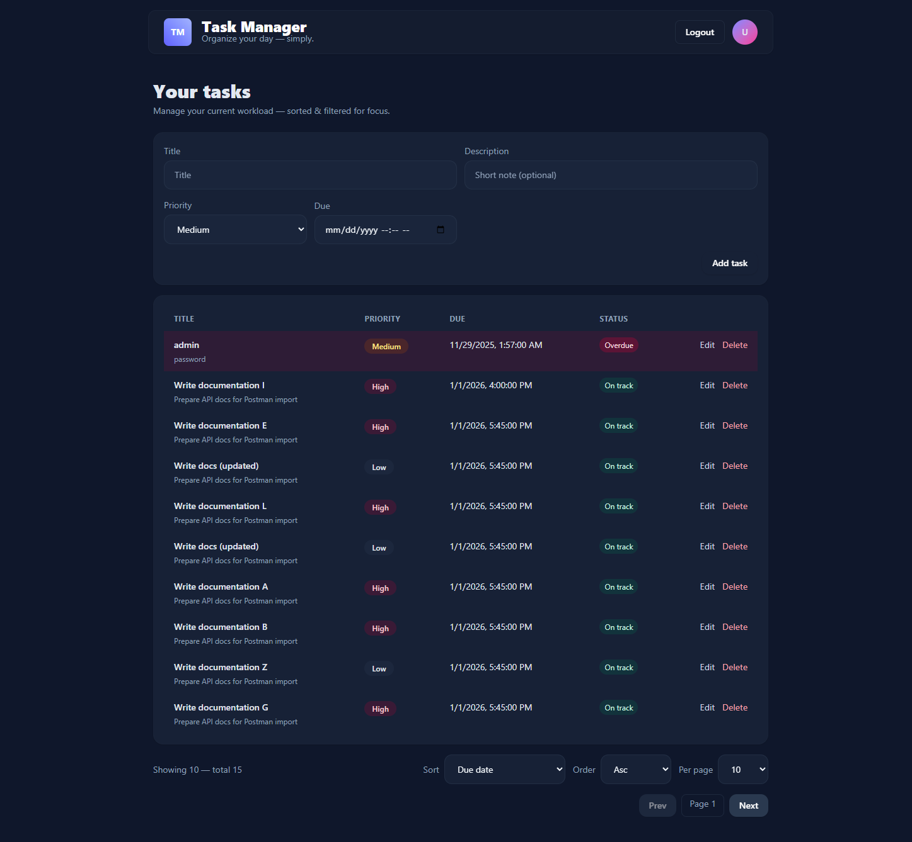

# Task Manager Dashboard

Lightweight task manager web app (React frontend + Express/TypeScript API) with JWT auth and PostgreSQL.

<p align="center">
	
</p>

## Requirements
- Node.js (>= 18)
- pnpm (uses workspace - recommended version: same as `package.json`'s `packageManager`)
- PostgreSQL database for the API

## Quick start
1. Install dependencies (from project root):

	```bash
	pnpm install
	```

2. Configure the API environment (create `apps/api/.env`):
    Create a .env file inside apps/api and update it accordingly:
    ```bash
    cp apps/api/.env.example apps/api/.env
    ```

3. Ensure a PostgreSQL database is available and the `DATABASE_URL` is set — the API will automatically apply migrations on startup.

4. Run both services (from root):

	```bash
	pnpm dev
	```

	Or run individually:
	- Backend: `cd apps/api && pnpm dev` (http://localhost:2080)
	- Frontend: `cd apps/app && pnpm dev -- --port 2081` (http://localhost:2081)

## Useful commands
- Install: `pnpm install`
- Dev (root): `pnpm dev` (runs dev for all workspaces via turbo)
- Lint: `pnpm lint`

If you need change or help with setup, see READMEs in [apps/api](apps/api) and [apps/app](apps/app).
